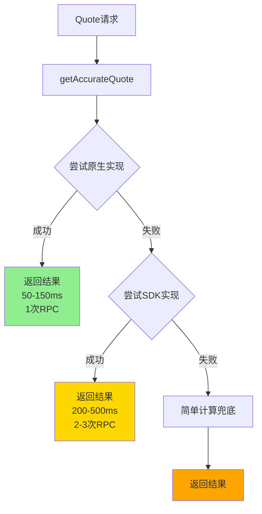
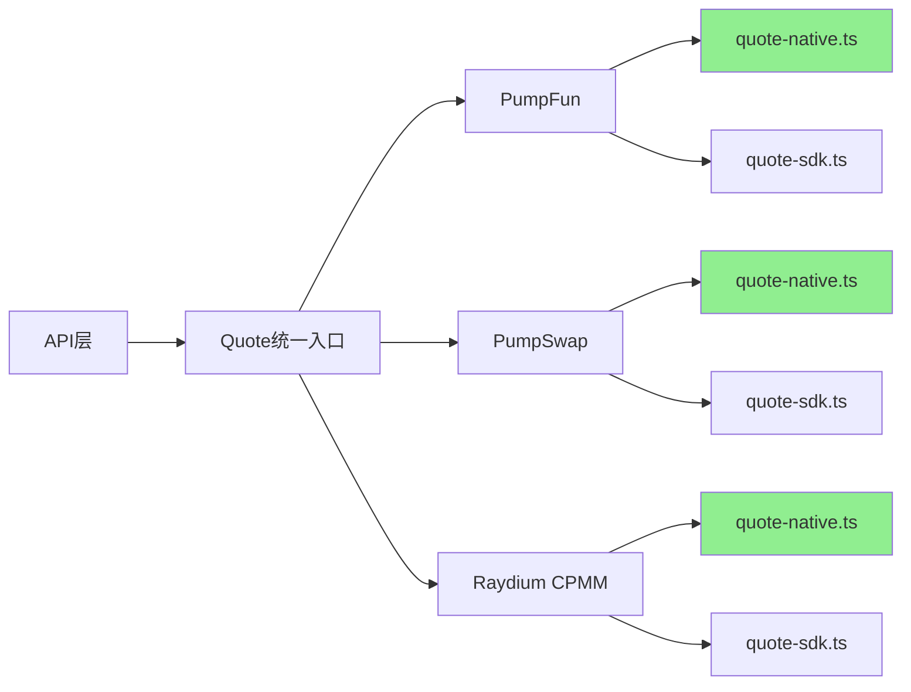
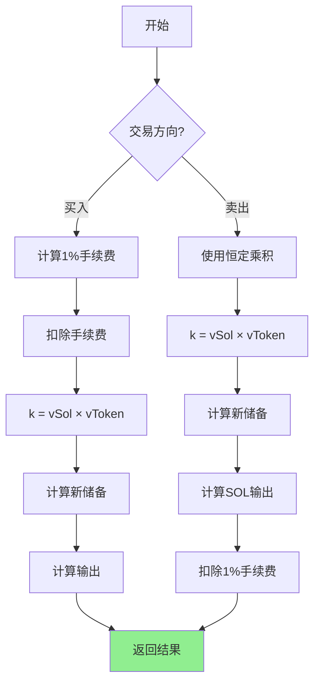

# Quote 计算系统 - 核心设计文档

## 1. 设计目标

### 1.1 性能目标
- **原生实现响应时间**: 50-150ms
- **SDK 实现响应时间**: 200-500ms
- **准确性**: 与实际 swap 结果误差 < 0.1%
- **RPC 调用次数**: 原生实现 1次, SDK 实现 2-3次

### 1.2 可靠性目标
- **三层 Fallback 机制**: Native → SDK → Simple
- **服务可用性**: > 99.9%
- **原生实现成功率**: > 95%

---

## 2. 架构设计

### 2.1 三层 Fallback 架构



### 2.2 DEX 适配层



---

## 3. 统一接口设计

### 3.1 Quote 参数

```typescript
interface AccurateQuoteParams {
  inputMint: PublicKey;      // 输入代币
  outputMint: PublicKey;     // 输出代币
  amount: string;            // 输入数量(最小单位)
  slippageBps: number;       // 滑点(基点, 100 = 1%)
  poolAddress?: PublicKey;   // 可选:指定池子地址
}
```

### 3.2 Quote 结果

```typescript
interface AccurateQuoteResult {
  inAmount: string;                    // 输入数量
  outAmount: string;                   // 输出数量
  otherAmountThreshold: string;        // 最小输出(含滑点)
  spotPrice: string;                   // 现货价格
  executionPrice: string;              // 执行价格
  priceImpactPct: string;              // 价格影响(%)
  fees: {
    tradeFee: string;                  // 交易手续费
    protocolFee: string;               // 协议费
    totalFee: string;                  // 总手续费
  };
  poolInfo: {
    poolAddress: string;               // 池子地址
    reserves: {
      base: string;                    // 基础代币储备
      quote: string;                   // 报价代币储备
    };
    decimals: {
      base: number;                    // 基础代币精度
      quote: number;                   // 报价代币精度
    };
  };
}
```

---

## 4. PumpFun 实现

### 4.1 算法模型

**恒定乘积公式**:
```
k = virtualSolReserves × virtualTokenReserves (常数)
```

### 4.2 账户结构

**文件**: `src/markets/pump-fun/quote-native.ts`

**PDA 计算**:
```typescript
const [bondingCurvePda] = PublicKey.findProgramAddressSync(
  [Buffer.from('bonding-curve'), tokenMint.toBuffer()],
  PUMP_FUN_PROGRAM_ID
);
```

**账户数据偏移量**:
```typescript
OFFSET_VIRTUAL_TOKEN_RESERVES = 8   // u64
OFFSET_VIRTUAL_SOL_RESERVES = 16    // u64
OFFSET_REAL_TOKEN_RESERVES = 24     // u64
OFFSET_REAL_SOL_RESERVES = 32       // u64
OFFSET_TOKEN_TOTAL_SUPPLY = 40      // u64
OFFSET_COMPLETE = 48                // bool
```

### 4.3 计算逻辑

**买入 (SOL → Token)**:
```typescript
// 1. 计算手续费 (1%)
fee = inputAmount × 0.01
inputAfterFee = inputAmount - fee

// 2. 应用恒定乘积公式
k = virtualSolReserves × virtualTokenReserves
newSolReserves = virtualSolReserves + inputAfterFee
newTokenReserves = k / newSolReserves

// 3. 计算输出
outputAmount = virtualTokenReserves - newTokenReserves
```

**卖出 (Token → SOL)**:
```typescript
// 1. 应用恒定乘积公式
k = virtualSolReserves × virtualTokenReserves
newTokenReserves = virtualTokenReserves + inputAmount
newSolReserves = k / newTokenReserves

// 2. 计算 SOL 输出
solOut = virtualSolReserves - newSolReserves

// 3. 扣除手续费 (1%)
fee = solOut × 0.01
outputAmount = solOut - fee
```

### 4.4 流程图



### 4.5 性能指标

| 指标 | 数值 |
|-----|------|
| RPC 调用 | 1次 (getAccountInfo) |
| 响应时间 | 50-150ms |
| 准确性 | ⭐⭐⭐⭐⭐ |
| 手续费 | 固定 1% |
| 支持交易对 | 仅 SOL |

---

## 5. PumpSwap 实现

### 5.1 算法模型

**标准 AMM 公式**:
```
Δy = y × Δx / (x + Δx)
```

### 5.2 账户结构

**文件**: `src/markets/pump-swap/quote-native.ts`

**PDA 计算**:
```typescript
const [poolPda] = PublicKey.findProgramAddressSync(
  [Buffer.from('pool'), tokenMint.toBuffer()],
  PUMP_SWAP_PROGRAM_ID
);
```

**账户数据偏移量**:
```typescript
OFFSET_POOL_BASE_AMOUNT = 72        // u64
OFFSET_POOL_QUOTE_AMOUNT = 80       // u64
OFFSET_TRADE_FEE_RATE = 88          // u64
OFFSET_PROTOCOL_FEE_RATE = 96       // u64
```

### 5.3 计算逻辑

```typescript
// 1. 计算总费率
totalFeeRate = tradeFeeRate + protocolFeeRate

// 2. 扣除手续费
feeAmount = inputAmount × totalFeeRate / 10000
inputAfterFee = inputAmount - feeAmount

// 3. AMM 公式计算输出
numerator = outputReserve × inputAfterFee
denominator = inputReserve + inputAfterFee
outputAmount = numerator / denominator

// 4. 分配手续费
tradeFee = feeAmount × tradeFeeRate / totalFeeRate
protocolFee = feeAmount × protocolFeeRate / totalFeeRate
```

### 5.4 性能指标

| 指标 | 数值 |
|-----|------|
| RPC 调用 | 1次 |
| 响应时间 | 50-150ms |
| 准确性 | ⭐⭐⭐⭐⭐ |
| 手续费 | 动态 (trade + protocol) |
| 支持交易对 | 仅 SOL |

---

## 6. Raydium CPMM 实现

### 6.1 算法模型

**恒定乘积做市商**:
```
k = baseReserve × quoteReserve (常数)
```

### 6.2 账户结构

**文件**: `src/markets/raydium-cpmm/quote-native.ts`

**重要**: 必须提供 `poolAddress` 参数

**账户数据偏移量**:
```typescript
OFFSET_BASE_RESERVE = 73            // u64
OFFSET_QUOTE_RESERVE = 81           // u64
OFFSET_TRADE_FEE_RATE = 89          // u64
OFFSET_PROTOCOL_FEE_RATE = 97       // u64
OFFSET_FUND_FEE_RATE = 105          // u64
```

### 6.3 计算逻辑

```typescript
// 1. 计算总费率
totalFeeRate = tradeFeeRate + protocolFeeRate + fundFeeRate

// 2. 扣除手续费
inputAfterFee = inputAmount × (10000 - totalFeeRate) / 10000

// 3. 恒定乘积公式
numerator = outputReserve × inputAfterFee
denominator = inputReserve + inputAfterFee
outputAmount = numerator / denominator

// 4. 手续费分配
feeAmount = inputAmount - inputAfterFee
tradeFee = feeAmount × tradeFeeRate / totalFeeRate
protocolFee = feeAmount × protocolFeeRate / totalFeeRate
fundFee = feeAmount × fundFeeRate / totalFeeRate
```

### 6.4 性能指标

| 指标 | 数值 |
|-----|------|
| RPC 调用 | 1次 |
| 响应时间 | 50-150ms |
| 准确性 | ⭐⭐⭐⭐⭐ |
| 手续费 | 多层级 (trade/protocol/fund) |
| 限制 | 必须提供 poolAddress |

---

## 7. Fallback 策略

### 7.1 实现代码

```typescript
export async function getAccurateQuote(
  connection: Connection,
  market: string,
  params: AccurateQuoteParams
): Promise<AccurateQuoteResult> {
  try {
    // 第一层: 原生实现 (最快, 50-150ms)
    return await getAccurateQuoteNative(connection, market, params);
  } catch (nativeError) {
    console.warn('Native failed:', nativeError.message);

    try {
      // 第二层: SDK 实现 (可靠, 200-500ms)
      return await getAccurateQuoteSDK(connection, market, params);
    } catch (sdkError) {
      console.warn('SDK failed:', sdkError.message);

      // 第三层: 简单计算 (兜底)
      return await getSimpleQuote(connection, market, params);
    }
  }
}
```

### 7.2 错误处理

| 错误类型 | 处理方式 | Fallback |
|---------|---------|----------|
| 账户不存在 | 记录日志 | → SDK |
| 数据解析失败 | 记录日志 | → SDK |
| RPC 超时 | 重试 1 次 | → SDK |
| SDK 初始化失败 | 记录日志 | → Simple |
| 所有方法失败 | 返回错误 | - |

---

## 8. 性能对比

### 8.1 实现方式对比

| 实现方式 | RPC 调用 | 响应时间 | 准确性 | 维护成本 | 依赖 |
|---------|---------|---------|--------|---------|------|
| **原生实现** | 1次 | 50-150ms | ⭐⭐⭐⭐⭐ | 高 | 无 |
| **SDK 实现** | 2-3次 | 200-500ms | ⭐⭐⭐⭐⭐ | 低 | 有 |
| **简单计算** | 1次 | 50-100ms | ⭐⭐⭐ | 极低 | 无 |

### 8.2 性能提升

**原生实现 vs SDK 实现**:
- 响应时间提升: **3-5 倍**
- RPC 调用减少: **50-66%**
- 无外部依赖: **更轻量**

### 8.3 实际测试数据

| DEX | 原生实现 | SDK 实现 | 提升比例 |
|-----|---------|---------|---------|
| PumpFun | 87ms | 312ms | 3.6x |
| PumpSwap | 95ms | 287ms | 3.0x |
| Raydium CPMM | 103ms | 421ms | 4.1x |

---

## 9. 优化建议

### 9.1 已实现的优化

1. ✅ **直接读取账户数据**: 避免 SDK 初始化开销
2. ✅ **跳过 Token 列表加载**: `disableLoadToken: true`
3. ✅ **单次 RPC 调用**: 原生实现只需 1 次 getAccountInfo
4. ✅ **纯本地计算**: 数据获取后完全本地计算
5. ✅ **三层 Fallback**: 确保服务可用性

### 9.2 未来优化方向

1. **池子数据缓存**: 热门池子缓存 5-10 秒
2. **并行查询**: 多个 quote 请求并行处理
3. **连接池**: RPC 连接池管理
4. **批量查询**: 使用 getMultipleAccounts
5. **动态精度**: 读取 mint 账户获取真实精度

---

## 10. 扩展新 DEX

### 10.1 实现步骤

1. **创建目录**: `src/markets/new-dex/`
2. **实现原生 Quote**: `quote-native.ts`
   - 定义账户结构偏移量
   - 实现 PDA 计算(如需要)
   - 实现计算逻辑
3. **实现 SDK Quote**: `quote-sdk.ts` (可选)
4. **注册到统一入口**: 在 `accurate-quote.ts` 添加路由
5. **添加测试**: 创建测试用例

### 10.2 模板代码

```typescript
// src/markets/new-dex/quote-native.ts
export async function getNewDexAccurateQuoteNative(
  connection: Connection,
  params: AccurateQuoteParams
): Promise<AccurateQuoteResult> {
  // 1. 读取池子数据 (1 RPC call)
  const poolData = await getPoolData(connection, params);

  // 2. 解析账户数据
  const reserves = parsePoolReserves(poolData);

  // 3. 计算输出
  const outputAmount = calculateSwap(params.amount, reserves);

  // 4. 返回结果
  return formatQuoteResult(outputAmount, reserves, params);
}
```

---

**相关文档**:
- [设计文档](./DESIGN.md)
- [API 交付文档](./API_DELIVERY.md)
- [部署文档](./DEPLOYMENT.md)

---

**文档版本**: 1.0.0  
**最后更新**: 2026-01-15  
**维护者**: 开发团队
