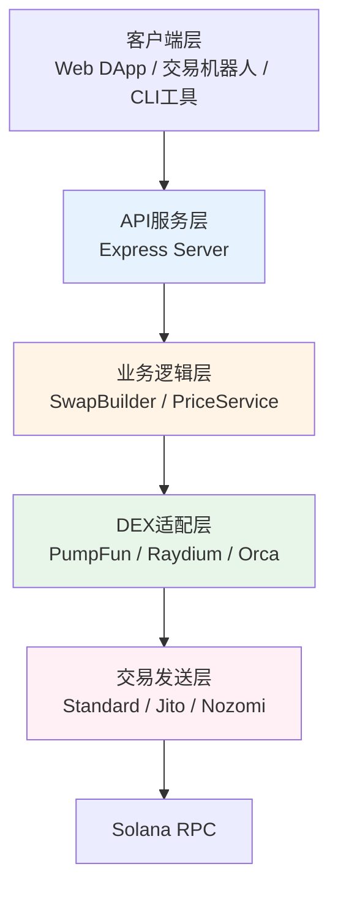
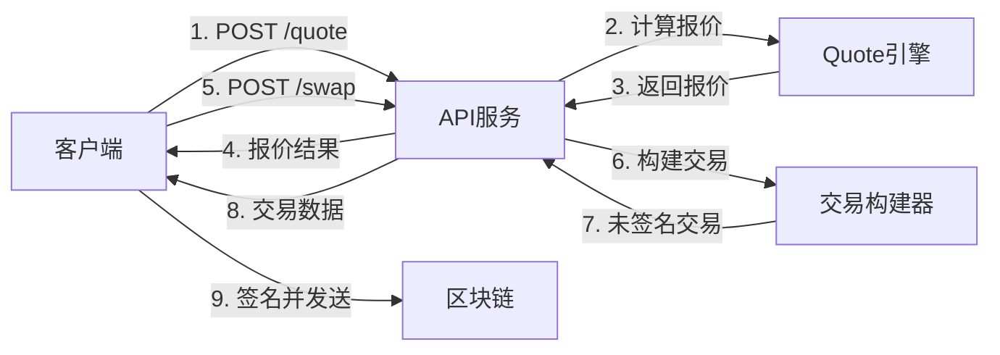
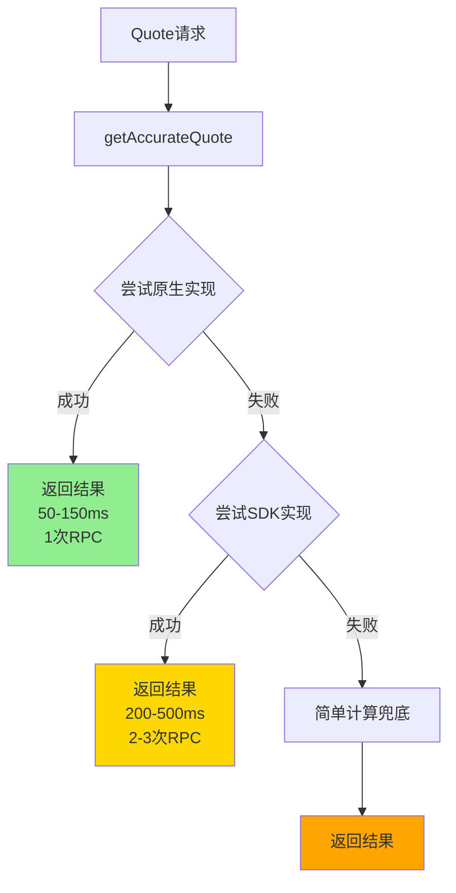
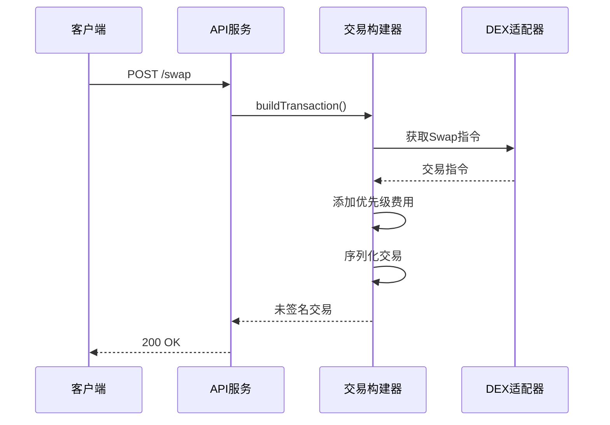

# Solana DEX 交易打包服务 - 设计文档

## 1. 项目背景

### 1.1 项目概述

Solana DEX 交易打包服务是一个功能完善的去中心化交易所(DEX)交易构建和执行服务,支持 Solana 生态中 15+ 主流 DEX 协议。本项目提供 Jupiter 风格的 RESTful API 接口,适用于交易机器人、DApp 集成、量化交易等场景。

### 1.2 业务价值

- **多协议支持**: 统一接口访问 15+ DEX,简化集成复杂度
- **MEV 保护**: 集成 Jito、Nozomi、Astralane 等 MEV 保护服务
- **高性能**: 优化的交易构建流程,支持高频交易场景
- **易用性**: Jupiter 兼容的 API 设计,降低学习成本

### 1.3 目标用户

- 交易机器人开发者
- DApp 开发团队
- 量化交易团队
- 个人交易者

### 1.4 技术目标

- Quote 响应时间 < 150ms (原生实现)
- 支持 15+ DEX 协议
- 99.9% 服务可用性
- 精确的价格计算(误差 < 0.1%)

---

## 2. 系统架构

### 2.1 整体架构图



### 2.2 核心模块

#### 2.2.1 API 服务层 (`src/api-server.ts`)
- 基于 Express 框架
- 提供 RESTful API 接口
- 请求验证和错误处理
- CORS 支持

#### 2.2.2 业务逻辑层
- **SwapBuilder** (`src/builder.ts`): 交易指令构建、优先级费用计算、交易序列化
- **PriceService**: 价格查询服务
- **PoolDiscovery**: 池子发现服务

#### 2.2.3 DEX 适配层 (`src/markets/`)
- 每个 DEX 独立的客户端实现
- 统一的接口抽象
- 原生实现 + SDK 实现双模式

#### 2.2.4 交易发送层 (`src/senders/`)
- **Standard**: 标准 RPC 发送
- **Jito**: MEV 保护
- **Nozomi**: MEV 保护
- **Astralane**: MEV 保护

---

## 3. 核心功能

### 3.1 功能列表

| 功能模块 | 功能描述 | 优先级 | 状态 |
|---------|---------|--------|------|
| Quote 计算 | 精确计算交易输出数量 | P0 | ✅ 已完成 |
| Swap 构建 | 构建未签名交易 | P0 | ✅ 已完成 |
| 池子发现 | 自动发现最优池子 | P1 | 🔄 进行中 |
| 价格查询 | 实时价格数据 | P1 | ✅ 已完成 |
| MEV 保护 | 集成多种 MEV 保护服务 | P1 | ✅ 已完成 |
| 市场列表 | 支持的 DEX 列表 | P2 | ✅ 已完成 |
| 健康检查 | 服务状态监控 | P2 | ✅ 已完成 |

### 3.2 支持的 DEX

| DEX | 类型 | Quote 实现 | 状态 |
|-----|------|-----------|------|
| PUMP_FUN | Bonding Curve | ✅ Native | 已完成 |
| PUMP_SWAP | AMM | ✅ Native | 已完成 |
| RAYDIUM_CPMM | CPMM | ✅ Native | 已完成 |
| RAYDIUM_AMM | AMM | SDK | 进行中 |
| RAYDIUM_CLMM | CLMM | SDK | 计划中 |
| ORCA_WHIRLPOOL | CLMM | SDK | 计划中 |
| METEORA_DLMM | DLMM | SDK | 计划中 |
| 其他 DEX | - | SDK | 计划中 |

---

## 4. 技术栈

### 4.1 核心技术

| 层级 | 技术 | 版本 | 说明 |
|-----|------|------|------|
| 运行时 | Node.js | 18+ | JavaScript 运行环境 |
| 语言 | TypeScript | 5.0+ | 类型安全的 JavaScript |
| Web 框架 | Express | 4.x | HTTP 服务器框架 |
| Solana SDK | @solana/web3.js | 1.x | Solana 区块链交互 |
| 大数计算 | bn.js | 5.x | 大整数运算 |

### 4.2 项目结构

```
solana_dex_build_node/
├── src/
│   ├── api-server.ts           # API 服务器
│   ├── builder.ts              # 交易构建器
│   ├── trader.ts               # 交易执行器
│   ├── cli.ts                  # CLI 工具
│   ├── helpers/
│   │   ├── accurate-quote.ts   # Quote 统一入口
│   │   └── ...
│   ├── interfaces/
│   │   ├── quote.ts            # Quote 接口定义
│   │   └── ...
│   ├── markets/
│   │   ├── pump-fun/
│   │   │   ├── quote-native.ts # 原生实现
│   │   │   ├── quote-sdk.ts    # SDK 实现
│   │   │   └── client.ts       # 交易构建
│   │   ├── pump-swap/
│   │   ├── raydium-cpmm/
│   │   └── ...
│   └── senders/
│       ├── standard.ts
│       ├── jito.ts
│       └── ...
├── test/
│   └── test-native-quotes.ts
├── docs/
│   ├── DESIGN.md               # 本文档
│   ├── CORE_DESIGN_QUOTE.md    # Quote 核心设计
│   ├── API_DELIVERY.md         # API 交付文档
│   ├── DEPLOYMENT.md           # 部署文档
│   └── TESTING.md              # 测试文档
├── package.json
└── tsconfig.json
```

---

## 5. 接口设计概览

### 5.1 API 端点

| 端点 | 方法 | 功能 | 状态 |
|-----|------|------|------|
| `/quote` | POST | 获取交易报价 | ✅ |
| `/swap` | POST | 构建交易 | ✅ |
| `/markets` | GET | 获取支持的市场列表 | ✅ |
| `/health` | GET | 健康检查 | ✅ |

### 5.2 数据流



---

## 6. 核心流程

### 6.1 Quote 计算流程



### 6.2 Swap 构建流程



---

## 7. 性能指标

### 7.1 目标指标

| 指标 | 目标值 | 当前值 | 状态 |
|-----|--------|--------|------|
| Quote 响应时间 (Native) | < 150ms | 50-150ms | ✅ |
| Quote 响应时间 (SDK) | < 500ms | 200-500ms | ✅ |
| 服务可用性 | > 99.9% | - | 🔄 |
| 原生实现成功率 | > 95% | - | 🔄 |
| 计算准确性 | > 99.9% | > 99.9% | ✅ |

### 7.2 性能优化

**已实现**:
- ✅ 原生实现(直接读取账户数据)
- ✅ 跳过 Token 列表加载
- ✅ 单次 RPC 调用
- ✅ 三层 Fallback 机制

**计划中**:
- 🔄 池子数据缓存
- 🔄 并行查询优化
- 🔄 RPC 连接池
- 🔄 批量查询支持

---

## 8. 安全考虑

### 8.1 安全措施

- **输入验证**: 所有 API 参数严格验证
- **错误处理**: 不暴露敏感信息
- **RPC 安全**: 使用可信的 RPC 节点
- **交易安全**: 只返回未签名交易,由客户端签名

### 8.2 风险控制

- **滑点保护**: 支持用户自定义滑点
- **价格影响**: 计算并返回价格影响
- **流动性检查**: 检测流动性不足情况
- **MEV 保护**: 支持多种 MEV 保护方案

---

## 9. 扩展性设计

### 9.1 DEX 扩展

新增 DEX 支持的步骤:
1. 在 `src/markets/` 创建新目录
2. 实现 `quote-native.ts` 或 `quote-sdk.ts`
3. 实现 `client.ts` 交易构建
4. 在 `accurate-quote.ts` 注册新 DEX
5. 添加测试用例

### 9.2 功能扩展

- **多跳路由**: 支持跨多个池子的最优路径
- **聚合报价**: 同时查询多个 DEX
- **历史数据**: 记录 quote 历史
- **实时监控**: WebSocket 推送

---

## 10. 相关文档

- [Quote 核心设计](./CORE_DESIGN_QUOTE.md) - Quote 计算系统详细设计
- [API 交付文档](./API_DELIVERY.md) - API 接口规范
- [部署文档](./DEPLOYMENT.md) - 部署和运维指南
- [测试文档](./TESTING.md) - 测试策略和用例

---

**文档版本**: 1.0.0  
**最后更新**: 2026-01-15  
**维护者**: 开发团队
