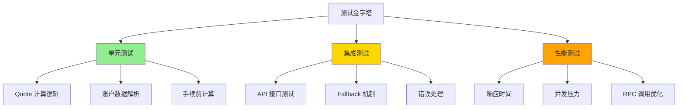

# 测试文档

## 目录
- [1. 测试策略](#1-测试策略)
- [2. 单元测试](#2-单元测试)
- [3. 集成测试](#3-集成测试)
- [4. 性能测试](#4-性能测试)
- [5. 自测代码](#5-自测代码)

---

## 1. 测试策略

### 1.1 测试层级



### 1.2 测试覆盖目标

| 测试类型 | 覆盖率目标 | 优先级 |
|---------|-----------|--------|
| 单元测试 | > 80% | P0 |
| 集成测试 | > 70% | P0 |
| API 测试 | 100% | P0 |
| 性能测试 | 核心路径 | P1 |

### 1.3 测试环境

**开发环境**:
- 本地 RPC 节点或测试网
- Mock 数据
- 快速反馈

**测试环境**:
- Devnet/Testnet
- 真实 RPC 节点
- 完整流程测试

**生产环境**:
- Mainnet
- 监控和告警
- 灰度发布

---

## 2. 单元测试

### 2.1 Quote 计算测试

**测试文件**: `test/test-native-quotes.ts`

**测试内容**:
- 账户数据解析
- AMM 算法计算
- 手续费计算
- 价格影响计算
- 滑点保护

**运行命令**:
```bash
npm run test:native
```

### 2.2 PumpFun 测试

```typescript
import { Connection, PublicKey } from '@solana/web3.js';
import { getPumpFunQuoteNative } from '../src/markets/pump-fun/quote-native';

describe('PumpFun Quote Native', () => {
  const connection = new Connection(process.env.RPC_URL!);
  
  test('买入 SOL -> Token', async () => {
    const result = await getPumpFunQuoteNative(connection, {
      inputMint: new PublicKey('So11111111111111111111111111111111111111112'),
      outputMint: new PublicKey('TOKEN_MINT'),
      amount: '10000000',
      slippageBps: 100
    });
    
    expect(result.outAmount).toBeDefined();
    expect(Number(result.outAmount)).toBeGreaterThan(0);
    expect(result.fees.tradeFee).toBeDefined();
    expect(result.priceImpactPct).toBeDefined();
  });
  
  test('卖出 Token -> SOL', async () => {
    const result = await getPumpFunQuoteNative(connection, {
      inputMint: new PublicKey('TOKEN_MINT'),
      outputMint: new PublicKey('So11111111111111111111111111111111111111112'),
      amount: '1000000000',
      slippageBps: 100
    });
    
    expect(result.outAmount).toBeDefined();
    expect(Number(result.outAmount)).toBeGreaterThan(0);
  });
  
  test('手续费计算正确', async () => {
    const result = await getPumpFunQuoteNative(connection, {
      inputMint: new PublicKey('So11111111111111111111111111111111111111112'),
      outputMint: new PublicKey('TOKEN_MINT'),
      amount: '10000000',
      slippageBps: 100
    });
    
    // PumpFun 固定 1% 手续费
    const expectedFee = Math.floor(10000000 * 0.01);
    expect(Number(result.fees.tradeFee)).toBe(expectedFee);
  });
});
```

### 2.3 PumpSwap 测试

```typescript
import { getPumpSwapQuoteNative } from '../src/markets/pump-swap/quote-native';

describe('PumpSwap Quote Native', () => {
  const connection = new Connection(process.env.RPC_URL!);
  
  test('AMM 计算正确', async () => {
    const result = await getPumpSwapQuoteNative(connection, {
      inputMint: new PublicKey('So11111111111111111111111111111111111111112'),
      outputMint: new PublicKey('TOKEN_MINT'),
      amount: '10000000',
      slippageBps: 100
    });
    
    expect(result.outAmount).toBeDefined();
    expect(result.fees.tradeFee).toBeDefined();
    expect(result.fees.protocolFee).toBeDefined();
  });
  
  test('手续费分配正确', async () => {
    const result = await getPumpSwapQuoteNative(connection, {
      inputMint: new PublicKey('So11111111111111111111111111111111111111112'),
      outputMint: new PublicKey('TOKEN_MINT'),
      amount: '10000000',
      slippageBps: 100
    });
    
    const totalFee = Number(result.fees.tradeFee) + Number(result.fees.protocolFee);
    expect(Number(result.fees.totalFee)).toBe(totalFee);
  });
});
```

### 2.4 Raydium CPMM 测试

```typescript
import { getRaydiumCpmmQuoteNative } from '../src/markets/raydium-cpmm/quote-native';

describe('Raydium CPMM Quote Native', () => {
  const connection = new Connection(process.env.RPC_URL!);
  
  test('CPMM 计算正确', async () => {
    const result = await getRaydiumCpmmQuoteNative(connection, {
      inputMint: new PublicKey('So11111111111111111111111111111111111111112'),
      outputMint: new PublicKey('EPjFWdd5AufqSSqeM2qN1xzybapC8G4wEGGkZwyTDt1v'),
      amount: '10000000',
      slippageBps: 100,
      poolAddress: new PublicKey('POOL_ADDRESS')
    });
    
    expect(result.outAmount).toBeDefined();
    expect(result.poolInfo.poolAddress).toBeDefined();
  });
  
  test('多层级手续费计算', async () => {
    const result = await getRaydiumCpmmQuoteNative(connection, {
      inputMint: new PublicKey('So11111111111111111111111111111111111111112'),
      outputMint: new PublicKey('EPjFWdd5AufqSSqeM2qN1xzybapC8G4wEGGkZwyTDt1v'),
      amount: '10000000',
      slippageBps: 100,
      poolAddress: new PublicKey('POOL_ADDRESS')
    });
    
    // 验证三层手续费
    expect(result.fees.tradeFee).toBeDefined();
    expect(result.fees.protocolFee).toBeDefined();
    // fundFee 可能为 0
  });
});
```

---

## 3. 集成测试

### 3.1 API 接口测试

**测试脚本**: `test/api-integration.test.ts`

```typescript
import axios from 'axios';

const API_BASE = 'http://localhost:3000';

describe('API Integration Tests', () => {
  test('GET /health', async () => {
    const response = await axios.get(`${API_BASE}/health`);
    expect(response.status).toBe(200);
    expect(response.data.status).toBe('ok');
  });
  
  test('GET /markets', async () => {
    const response = await axios.get(`${API_BASE}/markets`);
    expect(response.status).toBe(200);
    expect(response.data.markets).toContain('PUMP_FUN');
    expect(response.data.markets).toContain('PUMP_SWAP');
    expect(response.data.markets).toContain('RAYDIUM_CPMM');
  });
  
  test('POST /quote - PumpFun', async () => {
    const response = await axios.post(`${API_BASE}/quote`, {
      inputMint: 'So11111111111111111111111111111111111111112',
      outputMint: 'TOKEN_MINT',
      amount: '10000000',
      slippageBps: 100,
      market: 'PUMP_FUN'
    });
    
    expect(response.status).toBe(200);
    expect(response.data.outAmount).toBeDefined();
    expect(response.data.timeTaken).toBeLessThan(200);
  });
  
  test('POST /quote - 错误处理', async () => {
    try {
      await axios.post(`${API_BASE}/quote`, {
        inputMint: 'INVALID',
        outputMint: 'TOKEN_MINT',
        amount: '10000000',
        slippageBps: 100,
        market: 'PUMP_FUN'
      });
      fail('应该抛出错误');
    } catch (error: any) {
      expect(error.response.status).toBe(400);
      expect(error.response.data.error.code).toBe('INVALID_PARAMS');
    }
  });
});
```

### 3.2 Fallback 机制测试

```typescript
describe('Fallback Mechanism', () => {
  test('原生实现成功', async () => {
    const response = await axios.post(`${API_BASE}/quote`, {
      inputMint: 'So11111111111111111111111111111111111111112',
      outputMint: 'VALID_TOKEN_MINT',
      amount: '10000000',
      slippageBps: 100,
      market: 'PUMP_FUN'
    });
    
    expect(response.status).toBe(200);
    expect(response.data.timeTaken).toBeLessThan(150);
  });
  
  test('SDK Fallback 触发', async () => {
    // 模拟原生实现失败的场景
    const response = await axios.post(`${API_BASE}/quote`, {
      inputMint: 'So11111111111111111111111111111111111111112',
      outputMint: 'EDGE_CASE_TOKEN',
      amount: '10000000',
      slippageBps: 100,
      market: 'PUMP_FUN'
    });
    
    expect(response.status).toBe(200);
    // SDK 实现响应时间较长
    expect(response.data.timeTaken).toBeGreaterThan(150);
  });
});
```

### 3.3 端到端测试

```typescript
describe('End-to-End Flow', () => {
  test('完整交易流程', async () => {
    // 1. 获取 Quote
    const quoteResponse = await axios.post(`${API_BASE}/quote`, {
      inputMint: 'So11111111111111111111111111111111111111112',
      outputMint: 'TOKEN_MINT',
      amount: '10000000',
      slippageBps: 100,
      market: 'PUMP_FUN'
    });
    
    expect(quoteResponse.status).toBe(200);
    
    // 2. 构建交易
    const swapResponse = await axios.post(`${API_BASE}/swap`, {
      quoteResponse: quoteResponse.data,
      userPublicKey: 'USER_WALLET_ADDRESS',
      priorityFee: 0.0001
    });
    
    expect(swapResponse.status).toBe(200);
    expect(swapResponse.data.swapTransaction).toBeDefined();
    expect(swapResponse.data.lastValidBlockHeight).toBeDefined();
  });
});
```

---

## 4. 性能测试

### 4.1 响应时间测试

```bash
#!/bin/bash

# 测试 100 次请求的平均响应时间
TOTAL_TIME=0
COUNT=100

for i in $(seq 1 $COUNT); do
  START=$(date +%s%N)
  
  curl -s -X POST http://localhost:3000/quote \
    -H "Content-Type: application/json" \
    -d '{
      "inputMint": "So11111111111111111111111111111111111111112",
      "outputMint": "TOKEN_MINT",
      "amount": "10000000",
      "slippageBps": 100,
      "market": "PUMP_FUN"
    }' > /dev/null
  
  END=$(date +%s%N)
  ELAPSED=$((($END - $START) / 1000000))
  TOTAL_TIME=$(($TOTAL_TIME + $ELAPSED))
  
  echo "Request $i: ${ELAPSED}ms"
done

AVG_TIME=$(($TOTAL_TIME / $COUNT))
echo "Average response time: ${AVG_TIME}ms"
```

### 4.2 并发压力测试

```bash
# 使用 Apache Bench
ab -n 1000 -c 10 -p quote.json -T application/json \
  http://localhost:3000/quote

# 使用 wrk
wrk -t4 -c100 -d30s --latency \
  -s quote.lua \
  http://localhost:3000/quote
```

**wrk 脚本** (`quote.lua`):
```lua
wrk.method = "POST"
wrk.body = [[{
  "inputMint": "So11111111111111111111111111111111111111112",
  "outputMint": "TOKEN_MINT",
  "amount": "10000000",
  "slippageBps": 100,
  "market": "PUMP_FUN"
}]]
wrk.headers["Content-Type"] = "application/json"
```

### 4.3 性能基准

**目标指标**:
| 指标 | 目标值 | 测试方法 |
|-----|--------|---------|
| 平均响应时间 | < 150ms | 100 次请求平均 |
| 95th 百分位 | < 200ms | 压力测试 |
| 99th 百分位 | < 300ms | 压力测试 |
| 并发处理 | 100 QPS | wrk 测试 |
| 错误率 | < 0.1% | 1000 次请求 |

---

## 5. 自测代码

### 5.1 快速自测脚本

**文件**: `test/quick-test.ts`

```typescript
import { Connection, PublicKey } from '@solana/web3.js';
import { getPumpFunQuoteNative } from '../src/markets/pump-fun/quote-native';
import { getPumpSwapQuoteNative } from '../src/markets/pump-swap/quote-native';
import { getRaydiumCpmmQuoteNative } from '../src/markets/raydium-cpmm/quote-native';

async function quickTest() {
  const connection = new Connection(process.env.RPC_URL!);
  
  console.log('=== 开始快速自测 ===\n');
  
  // 测试 1: PumpFun
  console.log('测试 1: PumpFun Quote');
  try {
    const start = Date.now();
    const result = await getPumpFunQuoteNative(connection, {
      inputMint: new PublicKey('So11111111111111111111111111111111111111112'),
      outputMint: new PublicKey('TOKEN_MINT'),
      amount: '10000000',
      slippageBps: 100
    });
    const elapsed = Date.now() - start;
    
    console.log(`✅ 成功 - 响应时间: ${elapsed}ms`);
    console.log(`   输出数量: ${result.outAmount}`);
    console.log(`   手续费: ${result.fees.totalFee}`);
    console.log(`   价格影响: ${result.priceImpactPct}%\n`);
  } catch (error: any) {
    console.log(`❌ 失败 - ${error.message}\n`);
  }
  
  // 测试 2: PumpSwap
  console.log('测试 2: PumpSwap Quote');
  try {
    const start = Date.now();
    const result = await getPumpSwapQuoteNative(connection, {
      inputMint: new PublicKey('So11111111111111111111111111111111111111112'),
      outputMint: new PublicKey('TOKEN_MINT'),
      amount: '10000000',
      slippageBps: 100
    });
    const elapsed = Date.now() - start;
    
    console.log(`✅ 成功 - 响应时间: ${elapsed}ms`);
    console.log(`   输出数量: ${result.outAmount}`);
    console.log(`   交易手续费: ${result.fees.tradeFee}`);
    console.log(`   协议手续费: ${result.fees.protocolFee}\n`);
  } catch (error: any) {
    console.log(`❌ 失败 - ${error.message}\n`);
  }
  
  // 测试 3: Raydium CPMM
  console.log('测试 3: Raydium CPMM Quote');
  try {
    const start = Date.now();
    const result = await getRaydiumCpmmQuoteNative(connection, {
      inputMint: new PublicKey('So11111111111111111111111111111111111111112'),
      outputMint: new PublicKey('EPjFWdd5AufqSSqeM2qN1xzybapC8G4wEGGkZwyTDt1v'),
      amount: '10000000',
      slippageBps: 100,
      poolAddress: new PublicKey('POOL_ADDRESS')
    });
    const elapsed = Date.now() - start;
    
    console.log(`✅ 成功 - 响应时间: ${elapsed}ms`);
    console.log(`   输出数量: ${result.outAmount}`);
    console.log(`   池子地址: ${result.poolInfo.poolAddress}\n`);
  } catch (error: any) {
    console.log(`❌ 失败 - ${error.message}\n`);
  }
  
  console.log('=== 自测完成 ===');
}

quickTest().catch(console.error);
```

**运行**:
```bash
npx ts-node test/quick-test.ts
```

### 5.2 API 自测脚本

**文件**: `test/api-self-test.sh`

```bash
#!/bin/bash

API_BASE="http://localhost:3000"

echo "=== API 自测开始 ==="
echo ""

# 测试 1: 健康检查
echo "测试 1: 健康检查"
RESPONSE=$(curl -s -w "\n%{http_code}" $API_BASE/health)
HTTP_CODE=$(echo "$RESPONSE" | tail -n1)
BODY=$(echo "$RESPONSE" | head -n-1)

if [ "$HTTP_CODE" = "200" ]; then
  echo "✅ 成功 - HTTP $HTTP_CODE"
  echo "   响应: $BODY"
else
  echo "❌ 失败 - HTTP $HTTP_CODE"
fi
echo ""

# 测试 2: 获取市场列表
echo "测试 2: 获取市场列表"
RESPONSE=$(curl -s -w "\n%{http_code}" $API_BASE/markets)
HTTP_CODE=$(echo "$RESPONSE" | tail -n1)

if [ "$HTTP_CODE" = "200" ]; then
  echo "✅ 成功 - HTTP $HTTP_CODE"
else
  echo "❌ 失败 - HTTP $HTTP_CODE"
fi
echo ""

# 测试 3: PumpFun Quote
echo "测试 3: PumpFun Quote"
START=$(date +%s%N)
RESPONSE=$(curl -s -w "\n%{http_code}" -X POST $API_BASE/quote \
  -H "Content-Type: application/json" \
  -d '{
    "inputMint": "So11111111111111111111111111111111111111112",
    "outputMint": "TOKEN_MINT",
    "amount": "10000000",
    "slippageBps": 100,
    "market": "PUMP_FUN"
  }')
END=$(date +%s%N)
ELAPSED=$((($END - $START) / 1000000))
HTTP_CODE=$(echo "$RESPONSE" | tail -n1)

if [ "$HTTP_CODE" = "200" ]; then
  echo "✅ 成功 - HTTP $HTTP_CODE"
  echo "   响应时间: ${ELAPSED}ms"
else
  echo "❌ 失败 - HTTP $HTTP_CODE"
fi
echo ""

echo "=== API 自测完成 ==="
```

**运行**:
```bash
chmod +x test/api-self-test.sh
./test/api-self-test.sh
```

### 5.3 持续监控脚本

**文件**: `test/monitor.sh`

```bash
#!/bin/bash

API_BASE="http://localhost:3000"
INTERVAL=60  # 每 60 秒检查一次

while true; do
  TIMESTAMP=$(date '+%Y-%m-%d %H:%M:%S')
  
  # 健康检查
  HEALTH=$(curl -s $API_BASE/health)
  STATUS=$(echo $HEALTH | jq -r '.status')
  
  # Quote 性能测试
  START=$(date +%s%N)
  QUOTE=$(curl -s -X POST $API_BASE/quote \
    -H "Content-Type: application/json" \
    -d '{
      "inputMint": "So11111111111111111111111111111111111111112",
      "outputMint": "TOKEN_MINT",
      "amount": "10000000",
      "slippageBps": 100,
      "market": "PUMP_FUN"
    }')
  END=$(date +%s%N)
  ELAPSED=$((($END - $START) / 1000000))
  
  # 记录日志
  echo "[$TIMESTAMP] Status: $STATUS, Quote Time: ${ELAPSED}ms"
  
  # 告警检查
  if [ "$STATUS" != "ok" ]; then
    echo "⚠️  警告: 服务状态异常"
  fi
  
  if [ $ELAPSED -gt 300 ]; then
    echo "⚠️  警告: 响应时间过长 (${ELAPSED}ms)"
  fi
  
  sleep $INTERVAL
done
```

**运行**:
```bash
chmod +x test/monitor.sh
./test/monitor.sh > monitor.log 2>&1 &
```

---

## 6. 测试数据

### 6.1 测试代币

| DEX | Token Mint | Pool Address | 说明 |
|-----|-----------|--------------|------|
| PumpFun | 自动计算 | 自动计算 PDA | Bonding Curve |
| PumpSwap | 自动计算 | 自动计算 PDA | AMM Pool |
| Raydium CPMM | USDC | 需要提供 | SOL-USDC Pool |

### 6.2 测试场景

**场景 1: 小额交易**
- 输入: 0.01 SOL (10000000 lamports)
- 预期: 快速响应, 低价格影响

**场景 2: 中等交易**
- 输入: 1 SOL (1000000000 lamports)
- 预期: 正常响应, 中等价格影响

**场景 3: 大额交易**
- 输入: 10 SOL (10000000000 lamports)
- 预期: 可能较高价格影响

**场景 4: 边界条件**
- 输入: 1 lamport
- 预期: 正确处理最小单位

---

**相关文档**:
- [设计文档](./DESIGN.md)
- [核心设计 - Quote 计算](./CORE_DESIGN_QUOTE.md)
- [API 交付文档](./API_DELIVERY.md)
- [部署文档](./DEPLOYMENT.md)

---

**文档版本**: 1.0.0  
**最后更新**: 2026-01-15  
**维护者**: 开发团队
